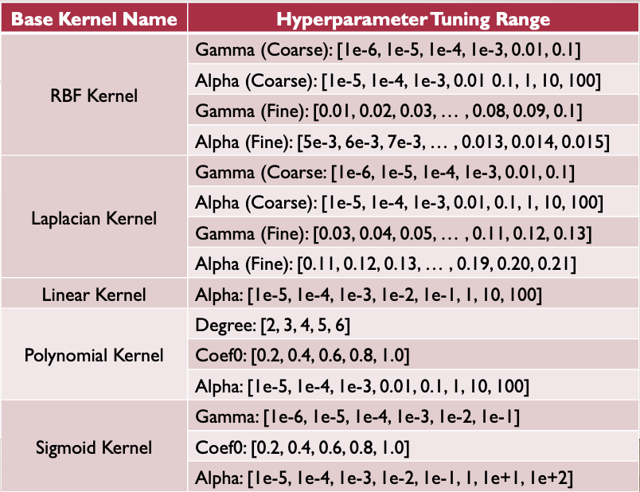
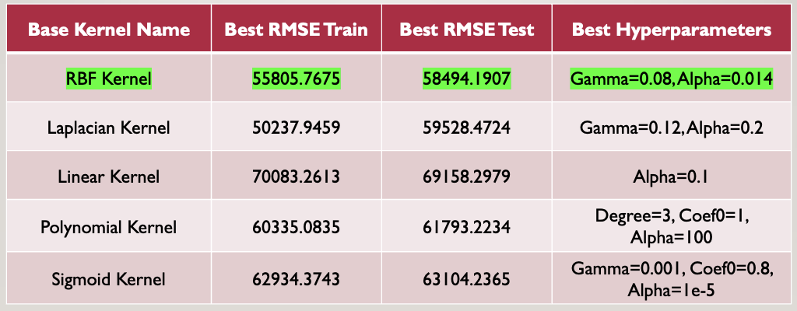
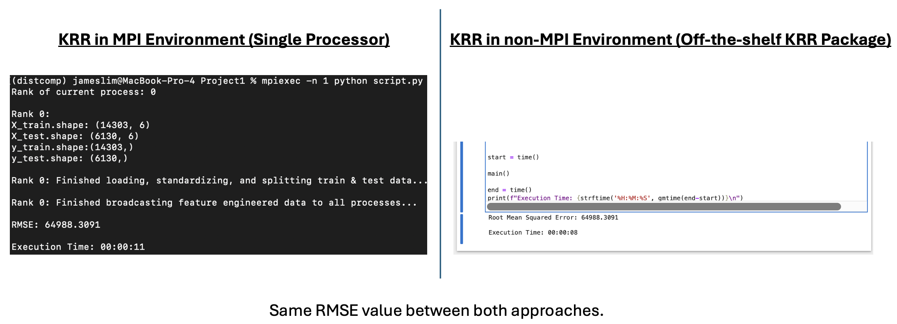

# Distributed_Computing_MPI

Predicting California housing prices using 1990 Census data. Implements kernel ridge regression with MPI for parallel processing. Includes dataset preparation, model training, evaluation, and standardization. Features a step-by-step guide to setting up the conda environment and running the MPI pipeline.


---

## Description

- The file housing.tsv Download [housing.tsv](https://canvas.nus.edu.sg/courses/60709/files/4324684?wrap=1) is a dataset containing the housing price information in California from the 1990 Census. The original data can be found at [https://www.dcc.fc.up.pt/~ltorgo/Regression/cal_housing.html](https://www.dcc.fc.up.pt/~ltorgo/Regression/cal_housing.html). This dataset frequently serves as an introduction to implementing machine learning algorithms. In this file, each row corresponds to an instance, and the meanings of the columns are as follows:
    1. **longitude**: A measure of how far west a house is; a higher value is farther west
    1. **latitude**: A measure of how far north a house is; a higher value is farther north
    1. **housingMedianAge**: Median age of a house within a block; a lower number is a newer building
    1. **totalRooms**: Total number of rooms within a block
    1. **totalBedrooms**: Total number of bedrooms within a block
    1. **population**: Total number of people residing within a block
    1. **households**: Total number of households, a group of people residing within a home unit, for a block
    1. **medianIncome**: Median income for households within a block of houses (measured in tens of thousands of US Dollars)
    1. **oceanProximity**: Location of the house w.r.t ocean/sea (0 = <1H OCEAN, 1 = INLAND, 2 = NEAR OCEAN, 3 = NEAR BAY)
    1. **medianHouseValue**: Median house value for households within a block (measured in US Dollars)

## Tasks

- The task is to predict the median house value according to the first 9 columns. The requirements are:
    - Split the dataset into the training data (70%) and the test data (30%).
    - Apply kernel ridge regression to the training data to generate the model.
    - Use MPI to implement kernel ridge regression in parallel.
    - Apply the model to both training and test data and find the root mean square error.
    - Consider standardizing the data to achieve better results.
    - Tune the parameters to find a satisfactory model.
    - Each group contains no more than 3 people.

---

# Instructions to Run the MPI Pipeline

## Step 1: Set up Conda Environment

- Create a new conda environment called `distcomp` based on packages that are dumped into YAML file below.
- Run below command in the terminal.

```bash
conda env create --file distcomp.yaml
```

## Step 2: Activate `distcomp` Conda Environment

- Run below command in the terminal.

```bash
conda activate distcomp
```

## Step 3 (Optional): Create Jupyter Notebook Kernel

- To ensure Jupyter Notebook runs with `distcomp` conda environment, need to install a kernel.
- If only need to run MPI pipeline, can skip this step. 
- The Jupyter notebook is primarily used to speed up debugging process.
- Run below command in the terminal.

```bash
python -m ipykernel install --user --name distcomp --display-name "Python 3.10 (distcomp)"
``` 

## Step 4: Run MPI Pipeline with Python Binding

- The number of participating processors can be adjusted accordingly by replacing the argument `2` below.
- Please ensure to run below command at same directory level as `housing_with_header.tsv` file.
- Run below command in the terminal. 

```bash
mpiexec -n 2 python script.py
```

---

# Data Preprocessing

- Standardized input features:
    - Ensured input features follow a normal distribution N(μ=0, σ=1) for faster convergence
    - Input features includes all columns except the target feature (`medianHouseValue`), and unique identifiers (`latitude`, `longitude`). 
    - Norminal feature (`oceanProximity`) also belongs to input features but it’s not standardized

- One-hot encoded the nominal feature (`oceanProximity`):
    - Converted `oceanProximity` to numerical values using one-hot encoding.

- Split data into training and testing sets (70:30 ratio):
    - Used random state 42 to split 70:30 between training and testing sets

---

# Kernel Functions

- Implemented various kernel functions: RBF (Radial Basis Function), Linear, Polynomial, Sigmoid, and Laplacian.

$$
\begin{align*}
\text{RBF Kernel:} \quad K(x_i, x_j) &= \exp(-\gamma \| x_i - x_j \|^2) \\
\text{Linear Kernel:} \quad K(x_i, x_j) &= x_i \cdot x_j \\
\text{Polynomial Kernel:} \quad K(x_i, x_j) &= (x_i \cdot x_j + coef_0)^d \\
\text{Sigmoid Kernel:} \quad K(x_i, x_j) &= \tanh(\gamma x_i \cdot x_j + coef_0) \\
\text{Laplacian Kernel:} \quad K(x_i, x_j) &= \exp(-\gamma \| x_i - x_j \|)
\end{align*}
$$

---

# Parallel Kernel Matrix Computation

- MPI: A standardized and portable message-parsing system designed to function on parallel computing architectures.
- Purpose: Enables efficient communication between multiple processes running on different nodes of a cluster.
- Steps in parallel kernel matrix computation:
    1. Initialization
        - MPI Communicator: `comm = MPI.COMM_WORLD`
        - Rank: `rank .= com.Get_rank()` # Identifies the process ID
        - Size: `size = comm.Get_size()` # number of processes
    1. Data Distribution
        - Training Data: Split data evenly across all processes.
        - Local Data: Each process works on a subset of the data (`local X`)
    1. Kernel Matrix Calculation
        - Local Computation
            - Each process computes its portion of the kernel matrix for its local data.
            - Example: `local K = kernel_base(local_X, local_X, **kwargs)`
        - Inter-Process Communication:
            - Processes exchange local data segments with each other.
            - Use of non-blocking sends (`comm.Issend`) and receives (`comm.Recv`) to share data efficiently.
    1. Combining Results
        - Local Results Aggregation
            - Each process computes kernel values for its data against data recieved from other processes.
        - Global Kernel Matrix
            - Root process (`rank == 0`) gathers all local kernel matrices into the global kernel matrix (`comm.Gather`)
    1. Synchronization
        - Barrier: `comm.Barrier()` ensures all processes complete their tasks before proceeding.
        - Final Kernel Matrix: Constructed on the root process, combining results from all processes.

---

# Hyperparameter Tuning

- Optimizations: Iterated through combinations of hyperparameters and selected parameters with the lowest RMSE.
- Note: Only RBF Kernel and Laplacian Kernel underwent fine-grained tuning range while others stopped at coares-grained tuning range as said 2 Kernels have similar best results from coarse-grained tuning range.



---

# Result



---

# Sanity Check

- As part of code validation, so far it has been verified that the RMSE results are the same between the following 2 executions:
    - KRR in non-MPI Environment (Using off-the-shelf Python package `sklearn.kernel_ridge.KernelRidge`)
    - KRR in MPI Environment (Using single processor + manual Kernel matrix implementation of KRR)



- The KRR in MPI Environment with multiple processors has been validated to successfully with matching RMSE results.

---

# Conclusion

- Summary: 
    - Successfully implemented and evaluated various kernel ridge regression models.

- Best Performance:
    - RBF Kernel with Gamma=0.08 and Alpha=0.014 attained lowest RMSE_train=55805.7675 and RMSE_test=58494.1907
    - This makes sense as RBF Kernel implicitly maps the input data to infinite-dimensional feature space and therefore it has the best expressive power to model very complex relationship in the data among other Kernels.

- Future Work: 
    - Explore additional kernels and further optimize hyperparameters.


